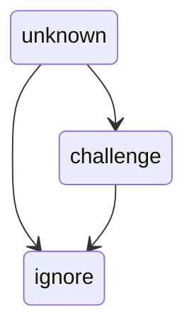

Postconfirm
===========

This is a milter that provides a challenge mechanism when encountering new senders. It does this by maintaining a list of confirmed email addresses and allowing messages from those senders through unchallenged. Where a sender is unknown then the email is stored and a challenge is issued, in the form of an email to be responded to. If the challenge is met then the sender is added to the list of confirmed emails and any stored emails from the sender are released back into the mail system. Whilst the challenge is active, any other incoming emails from the sender that should be challenged will be added to the log.

Whilst the previous version used files, this version uses a Postgres database. This makes it easier to deploy in a containerised environment since only the static configuration files needs to be provided. No special extensions or features are required in the database

In addition, the destination email addresses are examine to determine whether to `challenge` or `ignore` the message. 

The milter is configured using a file in the [CFG](https://docs.red-dove.com/cfg/intro.html) format, which is the current implementation of the previous configuration parser.

Challenge Process
-----------------

The first step is to determine whether this is a challenge response. If it is then the sender action will be updated to `accept` and any stored emails will be reinjected. The processing ends with the response email itself being `discard`ed.


Next the recipients are checked to determine if any require a challenge to have been met. The Challenge system uses a set of challenge handlers, each of which will identify the action to take. These are:

* `unknown`, the starting state. Returning this indicates that the handler has no opinion.
* `challenge`, which indicates that the handler requires the sender to be challenged.
* `ignore`, which indicates that the handler requires the message to be transmitted.

For each recipient, each handler is tried in turn and the action for that recipient updated on the following basis:



This flow accounts for the fact that a wide `challenge` is the most likely configuration with just some specific overrides.

If any recipient requires the sender to be challenged then the sender address will be looked up in the Senders.

* If they are `unknown` (explicitly, or not present in the database) or `expired` then the sender will move to the `confirm`  and the challenge will be sent. The incoming email will be stored and processing stops with the incoming email being `discard`ed.
* If they are `confirm`ing then the message will be stored and processing stops with the incoming email being `discard`ed.
* If they have the `accept` action then processing stops with no further action.
* If they have the `reject` action then processing stops with the incoming email being `reject`ed.
* If they have the `discard` action the processing stops with the incoming email being `discard`ed.

An `expired` sender did not respond to the challenge confirmation before their messages were purged.

The difference between `reject` and `discard` is how the MTA responds to the sending client. In the case of `reject` it will return an error message, indicating that the message was not accepted. In the case of `discard` it will return a success message, indicating that the message was accepted, but then silently drop the message with no further delivery attempts.

Challenges
----------

Matches can be made on the basis of a specific email address or a regular expression. Each challenge configuration is queried for an exact match to the specific email address, and if no match, for a list of regular expression patterns to match against. Patterns are "full match", ie they must match the whole email. 
There are two handlers built in:

* `internal`, which uses a table in the database.
* `query`, which allows allows a SQL query to be executed against a Postgres database.


### Internal

There is no configuration for this handler, and if no challenges are configured this will be added automatically. If there are multiple challenges then it's position in the challenge order is set by using an empty object, and it will only be used if this exists.

The table has the following columns:

| Column         | Values                               | Description                                                                                        |
|----------------|--------------------------------------|----------------------------------------------------------------------------------------------------|
| challenge      | Email Address, or Regular Expression | The email address to match, or the regular expression to match, as indicated by `challenge_type`.' |
| challenge_type | `E` or `P`                           | `E` indicates a specific `E`mail, and `P` indicates a `P`attern match.                             |
| action_to_take | `challenge` or `ignore`              | The action that this match should trigger.                                                         |


### Query

This handler allows for arbitrary queries to be used. For example, this could be used to find mailing lists. At least one query string should be provided.

An `action_query` is used to locate exact matches, and only the first result will be used. The action to take should be the only column returned. This will be executed with the `local_part` and `domain` query parameters.

A `pattern_query` is used to return a list of regular expressions and corresponding action. This should return rows consisting of the pattern and action columns. There are no query parameters.

| Key           | Type    | Description                                                                            |
|---------------|---------|----------------------------------------------------------------------------------------|
| name          | string  | A descriptive name for this challenge, used when logging.                              |
| type          | `query` | A fixed value indicating that this is a query challenge.                               |
| action_query  | string  | The SQL to execute to find an exact match.                                             |
| pattern_query | string  | The SQL to execute to return any patterns to match.                                    |
| db            | object  | The details of the Postgres database to query. See the main configuration for details. |


Configuration
-------------

### Main Configuration

| Key                 | Type             | Description                                                                                                         |
|---------------------|------------------|---------------------------------------------------------------------------------------------------------------------|
| log                 | object           | Settings relating to logging                                                                                        |
| log.level           | string/integer   | Log level to apply, eg `DEBUG`.                                                                                     |
| milter_port         | integer          | The port for the milter to listen on. Defaults to `1999`.                                                           |
| purge               | object           | Settings relating to purging stored messages                                                                        |
| purge.time_to_live  | integer          | Number of seconds to keep stored messages before discarding them. Default is 86400 seconds (1 day)                  |
| db                  | object           | Settings relating to the database                                                                                   |
| db.name             | string           | The name of the database                                                                                            |
| db.user             | string           | The user to connect to the database with                                                                            |
| db.password         | string           | The password to connect to the database with                                                                        |
| db.host             | string           | The hostname of the database                                                                                        |
| db.port             | integer          | The port to connect to the database on                                                                              |
| smtp_host           | string           | The hostname used to reinject messages/send challenges                                                              |
| smtp_port           | integer          | The port used to reinject messages/send challenges. Defaults to `5432`.                                             |
| mail_template       | string           | The path to the mustache template for the challenge email                                                           |
| admin_address       | string           | The email address that people can use to contact the administrator                                                  |
| remail_sender       | string           | The email address used as the SMTP FROM when sending emails                                                         |
| key_file            | string           | The path to the file containing the bytes for the key used to validate the confirmations                            |
| challenges          | array of objects | Challenge handler configurations. See [Challenge Handlers](#challenges). Defaults to the internal handler only.     |
| resend_confirmation | boolean          | Should a new challenge be sent if a new email is received whilst the sender is being challenged. Defaults to False. |

### Legacy Configuration

These settings are used to populate the database with existing data and for transitioning from file-based to database management.

| Key              | Type             | Description                                                                                     |
|------------------|------------------|-------------------------------------------------------------------------------------------------|
| confirmlist      | string           | The path to the file containing the managed list of emails that have been confirmed             |
| allowlists       | array of strings | The paths to the files containing the addresses that should always be allowed to send.          |
| allowregex       | array of strings | The paths to the files containing patterns for addresses that should always be allowed to send. |
| rejectlists      | array of strings | The paths to the files containing the addresses that should always be rejected.                 |
| rejectregex      | array of strings | The paths to the files containing patterns for addresses that should always be rejected.        |
| discardlists     | array of strings | The paths to the files containing the addresses that should always be discarded.                |
| discardregex     | array of strings | The paths to the files containing patterns for addresses that should always be discarded.       |
| challengelists   | array of strings | The paths to the files containing the recipients that should trigger a challenge.               |
| challengeregex   | array of strings | The paths to the files containing patterns for recipients that should trigger a challenge.      |
| nochallengelists | array of strings | The paths to the files containing the recipients that should not trigger a challenge.           |
| nochallengeregex | array of strings | The paths to the files containing patterns for recipients that should not trigger a challenge.  |
| mail_cache_dir   | string           | The path to the directory in which the stored messages are kept                                 |

*Note:* For historic reasons `white` and `black` are accepted as synonyms for `allow` and `reject` respectively, but this is officially deprecated.

### Example

```
smtp_host: 'smtp.example.com'
smtp_port: 1025

mail_template: "/app/samples/confirm.email.mustache"
admin_address:	"admin@example.com"
remail_sender: 'noreply@example.com'

key_file: "/app/samples/hash_key"

db: {
    name: 'postconfirm',
    user: 'postconfirm',
    password: 'foobar',
    host: 'postgres',
    # port: 5432,
}

log: {
    level: "DEBUG"
}

purge: {
    time_to_live: 84000
}

challenges: [
    { },
    {
        name: "foobar",
        type: "query",
        action_query: "SELECT action_to_take FROM foobar WHERE local_part=%(local_part)s AND domain_part=%(domain)s"
        db: {
            name: 'postconfirm',
            user: 'postconfirm',
            password: 'foobar',
            host: 'postgres',
        }
    }
]
milter_port: 1999

# Settings for import/migration.

confirmlist: "/app/samples/confirmed"
allowlists: [ "/app/samples/allowlist", "/app/samples/allow-whitelist" ]
allowregex: [ "/app/samples/allowregex" ]
rejectlists: [ "/app/samples/rejectlist" ]
rejectregex: [ "/app/samples/rejectregex" ]
discardlists: [ "/app/samples/discard" ]
discardregex: [ "/app/samples/discardregex" ]
# challengelists: [ "/a/challenge/list" ]
nochallengelists: [ "/app/samples/nochallengelist" ]
challengeregex: [ "/app/samples/challengeregex" ]
# nochallengeregex: [ "/a/no-challenge/regex" ]

mail_cache_dir: "/app/samples/cache/"

```


Database Initialisation
-----------------------

The schema is constructed by applying the files in the `sql/` directory in numerical order.

Utilities
---------

### extract_confirmed_accounts

This prints out the email addresses, one per line, that the postconfirm system (including legacy) has marked as having confirmed their email address (ie they are in the `accept` state.) This does not include entries imported from the accept lists.

This can be used to regenerate the file used for the `confirmlist`.

### purge_stash

This removes all the stored emails that are older than the Time To Live. This makes use of the `purge.time_to_live` configuration entry, but a value can also be specified using the `--ttl` argument. If a sender has no more stored emails and is in the `confirm` state they will moved to `expired` which will cause the confirmation process to restart on their next messaage.

The `-n` or `--dry-run` arguments will run the code without actually modifying the database. This is most useful if the `log.level` is set to `DEBUG` as this will then output what was being purged.

*Note:* With a dry run the script will under-report the number of senders being marked as `expired` since senders will still have their stored emails.

### update_static_lists

This replaces the imported sender actions and in-progress confirmations and makes them reflect the data in the configured source files.

For each type of data the static data table is truncated within a transaction and the new data loaded. Only on completion will the transaction be committed. This is both the most performant and the safest option as there is no period when the tables are empty. The actual update can be skipped by using the `-n` or `--dry-run` parameters.

There are 3 data sets:

* Senders: This covers the allow, reject, and discard lists
* In Progress: This covers the confirmations currently ongoing
* Challenges: This covers the challenge and no challenge lists

They are loaded in that order but a specific set can be skipped using the `--skip-senders`, `--skip-in-progress` or `--skip-challenges` parameter.

Any invalid entries will be logged (eg regexps that do not compile). Any missing files will be skipped.
